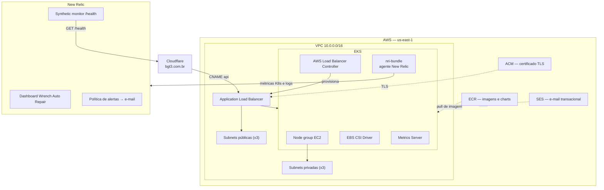

# infra-k8s — Infraestrutura Kubernetes

Terraform que provisiona **a plataforma** onde a aplicação Wrench Auto Repair roda: rede, cluster
EKS, certificado TLS, registro de imagens, DNS, e-mail transacional, o servidor de documentação
de arquitetura e a observabilidade no New Relic (agente do cluster, dashboards, alertas e
healthcheck externo).

FIAP · Pós-Tech · 13SOAT · Tech Challenge Fase 3 · Grupo **BGT³**

## Propósito

Este repositório **não** contém a aplicação nem o banco de dados. Ele entrega o cluster e os
recursos de borda; a aplicação é implantada por `app-k8s` via Helm, e o RDS é provisionado por
`infra-db`.

| Repositório | Conteúdo |
|---|---|
| **infra-k8s** (este) | VPC, EKS, ACM, ECR, DNS, SES, Structurizr, New Relic |
| `infra-db` | RDS PostgreSQL e role de menor privilégio |
| `app-k8s` | API .NET e chart Helm |
| `lambda-auth` | Function serverless de autenticação e API Gateway |

## Arquitetura



## Stacks Terraform

Cada stack é um workspace independente no HCP Terraform (organização `bgt3`). A separação existe
para que uma mudança de DNS não exija plano da infraestrutura inteira e para que um `apply` do
cluster não recrie recursos de outra natureza.

| Stack | Workspace HCP | Provisiona |
|---|---|---|
| `terraform/infra` | `wrench_auto_repair` | VPC, subnets, EKS, node group, ACM, addons, IRSA do LB Controller, CRDs da Gateway API |
| `terraform/ecr` | `wrench_auto_repair_ecr` | Repositórios ECR da imagem da API e dos charts Helm |
| `terraform/dns` | `wrench_auto_repair_dns` | CNAMEs da aplicação no Cloudflare apontando para o ALB |
| `terraform/email` | `wrench_auto_repair_email` | Identidade SES, DKIM e role IRSA usada pela aplicação |
| `terraform/structurizr` | `wrench_auto_repair_structurizr` | Túnel Cloudflare do Structurizr |
| `terraform/observability` | `wrench_auto_repair_observability` | Dashboard, política e condições de alerta, notificação por e-mail e synthetic monitor no New Relic |

### Outputs consumidos por outros repositórios

| Output | Consumido por | Para quê |
|---|---|---|
| `vpc_id`, `public_subnet_ids` | `infra-db` (stack `rds/`) | Posicionar o DB subnet group e o security group do Postgres |
| `cluster_name`, `acm_certificate_arn` | `app-k8s` | `aws eks update-kubeconfig` e certificado do Gateway |
| `oidc_provider_arn`, `oidc_provider_host` | stack `email/` | Trust policy da role IRSA |
| `app_hostnames` | stack `dns/` | Criar os CNAMEs corretos |
| `api_repository_url`, `chart_repository*` (stack `ecr`) | `app-k8s` | Destino do push da imagem e do chart |

## Tecnologias

- Terraform >= 1.5 com backend HCP Terraform
- Providers: AWS ~> 6.0, Cloudflare ~> 5.0, Helm ~> 2.17, kubectl, tls, http, New Relic ~> 3.0
- Amazon EKS, ACM, ECR, SES
- Cloudflare DNS e Cloudflare Tunnel
- New Relic: chart `nri-bundle`, dashboards, alertas e Synthetics
- GitHub Actions

## Como executar

```bash
# autenticar no HCP Terraform
terraform login

cd terraform/infra
terraform init
terraform plan  -var='acm_domains=["api.bgt3.com.br"]'
terraform apply -var='acm_domains=["api.bgt3.com.br"]'
```

Repita para os demais stacks. A ordem de dependência é:

```
infra  →  ecr        (independente, pode rodar em paralelo)
infra  →  email      (precisa do OIDC provider)
infra  →  dns        (precisa do ALB programado pelo app-k8s)
infra + ecr → structurizr
infra  →  nri-bundle (Helm, precisa do cluster)
observability        (independente da AWS; só depende da conta New Relic)
```

O detalhamento de variáveis por stack está em [`terraform/README.md`](./terraform/README.md).

## Deploy

| Gatilho | O que acontece |
|---|---|
| Pull request para `master` | `fmt -check`, `init`, `validate` e `plan` de cada stack, em matriz |
| Push em `master` | `apply` de `infra`, `ecr`, `email`, `structurizr`, `dns` e `observability`; `helm upgrade --install` do `nri-bundle` |
| `workflow_dispatch` | Mesmo fluxo do push, sob demanda |

O workflow `destroy.yml` derruba a infraestrutura e é acionado apenas manualmente.

> **Ambiente de homologação:** não existe um segundo cluster. Duplicar VPC, EKS e ALB não se
> justifica no custo deste projeto, então a segregação de ambientes acontece por **namespace no
> mesmo cluster** — quem cria o namespace `homologacao` é o pipeline do `app-k8s`. O PR neste
> repositório é validado por `plan`, e `master` é o único gatilho de `apply`. A decisão está
> registrada no ADR de uso de HPA e ambientes, em `app-k8s/docs/adrs`.

### Variáveis e secrets

| Nome | Tipo | Descrição |
|---|---|---|
| `TF_API_TOKEN` | secret | Token do HCP Terraform |
| `AWS_REGION` | variable | Região AWS |
| `CLOUDFLARE_API_TOKEN` | secret | Token com permissão `Zone.DNS:Edit` |
| `CLOUDFLARE_ZONE_ID` | secret | Zone ID do domínio |
| `AWS_ACCESS_KEY_ID` / `AWS_SECRET_ACCESS_KEY` | secret | Acesso ao cluster para os deploys Helm (Structurizr e `nri-bundle`) |
| `NEW_RELIC_LICENSE_KEY` | secret | Ingest - License Key, usada pelo `nri-bundle` |
| `NEW_RELIC_API_KEY` | secret | User API Key (`NRAK-...`), usada pelo provider Terraform do stack `observability` |
| `NEW_RELIC_ACCOUNT_ID` | secret | ID da conta New Relic |
| `NEW_RELIC_ALERT_EMAIL` | variable | E-mail que recebe as notificações de alerta |

Credenciais AWS e variáveis específicas de stack são configuradas diretamente nos workspaces do
HCP Terraform.

## Observabilidade

| Peça | Onde | O que entrega |
|---|---|---|
| Agente do cluster | [`newrelic-k8s/`](./newrelic-k8s/README.md), workflow `newrelic.yml` | CPU, memória, restarts e eventos de nós e pods; logs do `stdout` dos containers |
| Dashboard `Wrench Auto Repair` | `terraform/observability/dashboard.tf` | Páginas Negócio, API, Integrações, Kubernetes e Healthcheck |
| Política `Wrench Auto Repair` | `terraform/observability/alerts.tf` | Condições de falha no processamento de OS, erro 5xx, latência p95, restart de pod e healthcheck, com notificação por e-mail |
| Synthetic monitor `Wrench API - healthcheck` | `terraform/observability/synthetics.tf` | `GET https://api.bgt3.com.br/health` a cada 5 minutos, de fora do cluster |

Traces, métricas e logs da API são exportados pela própria aplicação via OTLP. As consultas NRQL de
cada painel e o significado de cada métrica estão no repositório `app-k8s`, em
`docs/observability/dashboards-nrql.md`, e a decisão da ferramenta no ADR 003.

## Manifestos e charts auxiliares

- `structurizr-k8s/` — chart Helm do Structurizr Lite (documentação C4 servida no cluster)
- `kubernetes/structurizr/` — manifestos brutos equivalentes, mantidos como referência de leitura
- `newrelic-k8s/` — values do chart oficial `newrelic/nri-bundle`
