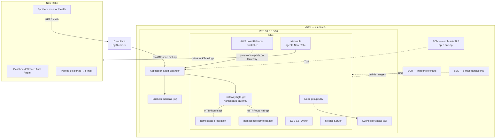
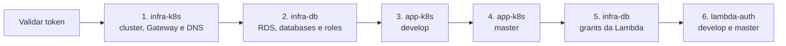
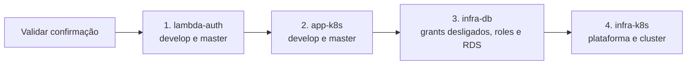

# infra-k8s — Infraestrutura Kubernetes

Terraform e manifestos que provisionam **a plataforma** onde a aplicação Wrench Auto Repair roda:
rede, cluster EKS, certificado TLS, Gateway de entrada, registro de imagens, DNS, e-mail
transacional, o servidor de documentação de arquitetura e a observabilidade no New Relic (agente do
cluster, dashboards, alertas e healthcheck externo).

FIAP · Pós-Tech · 15SOAT · Tech Challenge Fase 3 · Grupo **BGT³**

## Propósito

Este repositório **não** contém a aplicação nem o banco de dados. Ele entrega o cluster e os
recursos de borda; a aplicação é implantada por `app-k8s` via Helm, e o RDS é provisionado por
`infra-db`.

| Repositório | Conteúdo |
|---|---|
| **infra-k8s** (este) | VPC, EKS, ACM, Gateway de plataforma, ECR, DNS, SES, Structurizr, New Relic e orquestradores |
| `infra-db` | RDS PostgreSQL, databases por ambiente e roles de menor privilégio |
| `app-k8s` | API .NET e chart Helm |
| `lambda-auth` | Function serverless de autenticação e API Gateway |

## Arquitetura



## Stacks Terraform

Cada stack é um workspace independente no HCP Terraform (organização `bgt3`). A separação existe
para que uma mudança de DNS não exija plano da infraestrutura inteira e para que um `apply` do
cluster não recrie recursos de outra natureza.

| Stack | Workspace HCP | Provisiona |
|---|---|---|
| `terraform/infra` | `wrench_auto_repair` | VPC, subnets, EKS, node group, ACM, addons, IRSA do LB Controller, CRDs da Gateway API |
| `terraform/ecr` | `wrench_auto_repair_ecr` | Repositórios ECR da imagem da API e dos charts Helm |
| `terraform/dns` | `wrench_auto_repair_dns` | CNAMEs da aplicação no Cloudflare apontando para o ALB |
| `terraform/email` | `wrench_auto_repair_email` | Identidade SES, DKIM e role IRSA usada pela aplicação nos dois namespaces |
| `terraform/structurizr` | `wrench_auto_repair_structurizr` | Túnel Cloudflare do Structurizr |
| `terraform/observability` | `wrench_auto_repair_observability` | Dashboard, política e condições de alerta, notificação por e-mail e synthetic monitor no New Relic |

### Outputs consumidos por outros repositórios

| Output | Consumido por | Para quê |
|---|---|---|
| `vpc_id`, `public_subnet_ids` | `infra-db` (stack `rds/`) | Posicionar o DB subnet group e o security group do Postgres |
| `cluster_name` | `app-k8s` e job `gateway` | `aws eks update-kubeconfig` |
| `acm_certificate_arn` | job `gateway` | Certificado do listener HTTPS do Gateway de plataforma |
| `oidc_provider_arn`, `oidc_provider_host` | stack `email/` | Trust policy da role IRSA |
| `app_hostnames` | stack `dns/` | Criar os CNAMEs corretos |
| `api_repository_url`, `chart_repository*` (stack `ecr`) | `app-k8s` | Destino do push da imagem e do chart |

## Gateway de plataforma

O ALB público é um só para os dois ambientes. Ele nasce do `Gateway` `bgt3-gw`, no namespace
`gateway`, aplicado pelo job `gateway` (workflow `gateway.yml`) a partir de
[`kubernetes/gateway/`](./kubernetes/gateway):

| Manifesto | Recurso | Função |
|---|---|---|
| `namespace.yaml` | `Namespace` `gateway` | Isola os recursos de borda das aplicações |
| `loadbalancerconfiguration.yaml` | `LoadBalancerConfiguration` `bgt3-gw-lbconfig` | ALB `internet-facing` e certificado ACM do listener HTTPS; o marcador `__ACM_CERTIFICATE_ARN__` é substituído pelo output `acm_certificate_arn` no pipeline |
| `gateway.yaml` | `Gateway` `bgt3-gw` | Listeners HTTP 80 e HTTPS 443, aceitando rotas de qualquer namespace |

Restrições:

* A aplicação não cria Gateway: cada release do `app-k8s` publica apenas a própria `HTTPRoute`
  (namespaces `production` e `homologacao`) com `parentRefs` apontando para `bgt3-gw` no namespace
  `gateway`, seção `https`.
* O certificado é único para o ALB, então `acm_domains` precisa listar todos os hostnames das
  rotas: `api.bgt3.com.br` e `hml-api.bgt3.com.br`.
* O stack `dns` lê o ALB pela tag do cluster e cria um CNAME por hostname; ele depende do job
  `gateway` e só roda depois que o Gateway fica `Programmed`.

## Tecnologias

- Terraform >= 1.5 com backend HCP Terraform
- Providers: AWS ~> 6.0, Cloudflare ~> 5.0, Helm ~> 2.17, kubectl, tls, http, New Relic ~> 3.0
- Amazon EKS, ACM, ECR, SES
- Gateway API com AWS Load Balancer Controller
- Cloudflare DNS e Cloudflare Tunnel
- New Relic: chart `nri-bundle`, dashboards, alertas e Synthetics
- GitHub Actions

## Como executar

```bash
terraform login

cd terraform/infra
terraform init
terraform plan
terraform apply
```

Repita para os demais stacks. A ordem de dependência é:

```
infra  →  gateway    (kubectl; precisa do cluster e do certificado ACM)
gateway →  dns       (precisa do ALB criado pelo Gateway)
infra  →  ecr        (independente, pode rodar em paralelo)
infra  →  email      (precisa do OIDC provider)
infra + ecr → structurizr
infra  →  nri-bundle (Helm, precisa do cluster)
observability        (independente da AWS; só depende da conta New Relic)
```

O detalhamento de variáveis por stack está em [`terraform/README.md`](./terraform/README.md).

## Deploy

| Gatilho | O que acontece |
|---|---|
| Pull request para `master` | `fmt -check`, `init`, `validate` e `plan` de cada stack, em matriz |
| Push em `master` | `apply` de `infra`, `ecr`, `email`, `structurizr` e `observability`; Gateway de plataforma; `dns` depois do Gateway; `helm upgrade --install` do `nri-bundle` |
| `workflow_dispatch` com `etapa=completo` | Mesmo fluxo do push, sob demanda |
| `workflow_dispatch` com `etapa=somente-dns` | Reaplica apenas os CNAMEs da aplicação |

> **Ambientes:** não existe um segundo cluster. Duplicar VPC, EKS e ALB não se justifica no custo
> deste projeto, então homologação e produção compartilham cluster, Gateway e ALB e se separam por
> **namespace**, hostname e database. Quem cria os namespaces `production` e `homologacao` é o
> pipeline do `app-k8s`. O PR neste repositório é validado por `plan`, e `master` é o único gatilho
> de `apply`. A decisão está registrada no ADR de uso de HPA e ambientes, em `app-k8s/docs/adrs`.

### Variáveis e secrets

| Nome | Tipo | Descrição |
|---|---|---|
| `TF_API_TOKEN` | secret | Token do HCP Terraform |
| `AWS_REGION` | variable | Região AWS |
| `CLOUDFLARE_API_TOKEN` | secret | Token com permissão `Zone.DNS:Edit` |
| `CLOUDFLARE_ZONE_ID` | secret | Zone ID do domínio |
| `AWS_ACCESS_KEY_ID` / `AWS_SECRET_ACCESS_KEY` | secret | Acesso ao cluster para o Gateway de plataforma e os deploys Helm (Structurizr e `nri-bundle`) |
| `NEW_RELIC_LICENSE_KEY` | secret | Ingest - License Key, usada pelo `nri-bundle` |
| `NEW_RELIC_API_KEY` | secret | User API Key (`NRAK-...`), usada pelo provider Terraform do stack `observability` |
| `NEW_RELIC_ACCOUNT_ID` | secret | ID da conta New Relic |
| `NEW_RELIC_ALERT_EMAIL` | variable | E-mail que recebe as notificações de alerta |
| `ORQUESTRADOR_TOKEN` | secret | Fine-grained token usado pelos orquestradores para disparar e acompanhar os pipelines dos quatro repositórios |

Credenciais AWS e variáveis específicas de stack são configuradas diretamente nos workspaces do
HCP Terraform.

## Orquestrador de provisionamento

O workflow **Orquestrador de Provisionamento** (`.github/workflows/orquestrador.yml`) sobe o
ambiente completo a partir de um único *Run workflow*. Ele não aplica nada diretamente: dispara o
pipeline de cada repositório, acompanha a execução e só avança quando ela termina com sucesso. Cada
pipeline roda no próprio repositório, com os próprios secrets, e aparece normalmente na aba Actions
dele.



| Entrada | Valores | Efeito |
|---|---|---|
| `ambientes` | `ambos`, `homologacao`, `production` | Quais ambientes da aplicação e da Lambda são implantados |
| `infraestrutura` | `true`, `false` | Com `false`, pula as etapas 1 e 2 e implanta só aplicação, grants e Lambda |

Restrições:

* A ordem é imposta pelos states do HCP Terraform: o `infra-db` lê a rede do `infra-k8s`, a
  aplicação lê cluster e banco, e a Lambda lê o banco e depende das tabelas criadas pelas
  migrations de cada ambiente.
* A etapa 5 grava `true` em `LAMBDA_AUTH_GRANTS_PRODUCTION` e/ou `LAMBDA_AUTH_GRANTS_HOMOLOGACAO`
  no `infra-db`, conforme os ambientes implantados, e só reaplica os roles quando alguma variable
  mudou ou quando a etapa 2 não rodou. Persistir o valor impede que um push posterior no
  `infra-db` revogue os grants.
* Uma falha interrompe as etapas seguintes; o resumo da execução lista o link de cada pipeline
  disparado.
* Os dois orquestradores compartilham o grupo de concorrência `orquestrador-ambiente`: nunca rodam
  ao mesmo tempo.
* O secret `ORQUESTRADOR_TOKEN` é um *fine-grained personal access token* restrito aos repositórios
  `infra-k8s`, `infra-db`, `app-k8s` e `lambda-auth`, com as permissões **Actions: Read and write**,
  **Variables: Read and write** e **Contents: Read-only**. O `GITHUB_TOKEN` padrão não dispara
  workflows em outros repositórios.

## Orquestrador de destruição

O workflow **Orquestrador de Destruição** (`.github/workflows/orquestrador-destruicao.yml`) remove o
ambiente na ordem inversa do provisionamento, disparando o `destroy.yml` de cada repositório.



| Entrada | Valor | Efeito |
|---|---|---|
| `confirmacao` | `DESTRUIR` | Qualquer outro valor encerra a execução antes de disparar qualquer pipeline |

Restrições:

* Cada `destroy.yml` disparado recebe `confirmacao=DESTRUIR`.
* A etapa 3 grava `false` em `LAMBDA_AUTH_GRANTS_PRODUCTION` e `LAMBDA_AUTH_GRANTS_HOMOLOGACAO` antes
  de destruir o banco, para que o próximo provisionamento não tente conceder grants em tabelas que
  ainda não existem.
* A Lambda e a aplicação saem antes do banco e da plataforma: as rotas deixam de existir antes do
  ALB, e nenhum recurso do cluster fica preso a uma VPC em remoção.
* Não são removidos: os workspaces e as variáveis do HCP Terraform, os repositórios, secrets e
  variables do GitHub, os environments e a conta New Relic. Um novo provisionamento reutiliza todos.

## Observabilidade

| Peça | Onde | O que entrega |
|---|---|---|
| Agente do cluster | [`newrelic-k8s/`](./newrelic-k8s/README.md), workflow `newrelic.yml` | CPU, memória, restarts e eventos de nós e pods; logs do `stdout` dos containers |
| Dashboard `Wrench Auto Repair` | `terraform/observability/dashboard.tf` | Páginas Negócio, API, Integrações, Kubernetes e Healthcheck |
| Política `Wrench Auto Repair` | `terraform/observability/alerts.tf` | Condições de falha no processamento de OS, erro 5xx, latência p95, restart de pod e healthcheck, com notificação por e-mail |
| Synthetic monitor `Wrench API - healthcheck` | `terraform/observability/synthetics.tf` | `GET https://api.bgt3.com.br/health` a cada 5 minutos, de fora do cluster |

Traces, métricas e logs da API são exportados pela própria aplicação via OTLP. As consultas NRQL de
cada painel e o significado de cada métrica estão no repositório `app-k8s`, em
`docs/observability/dashboards-nrql.md`, e a decisão da ferramenta no ADR 003.

## Manifestos e charts auxiliares

- `kubernetes/gateway/` — Gateway de plataforma e sua LoadBalancerConfiguration
- `structurizr-k8s/` — chart Helm do Structurizr Lite (documentação C4 servida no cluster)
- `kubernetes/structurizr/` — manifestos brutos equivalentes, mantidos como referência de leitura
- `newrelic-k8s/` — values do chart oficial `newrelic/nri-bundle`
